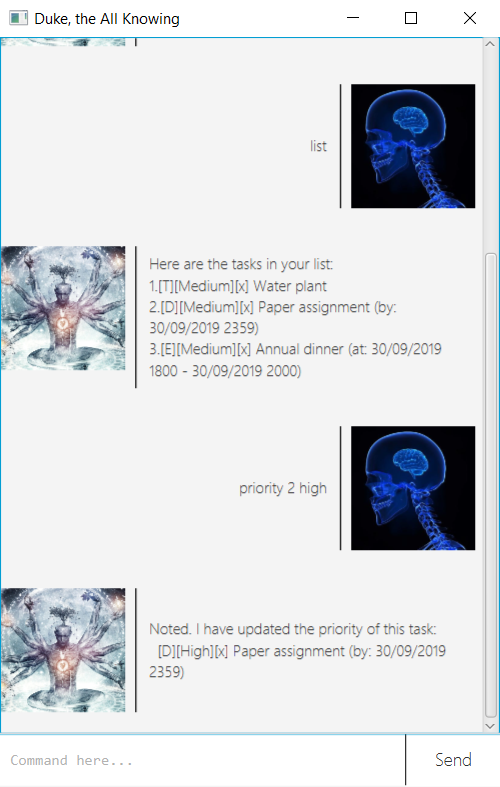
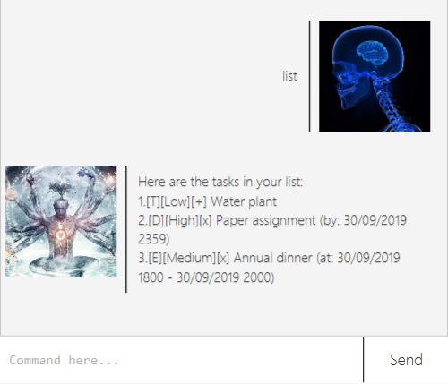
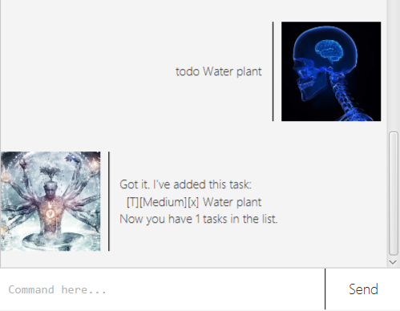
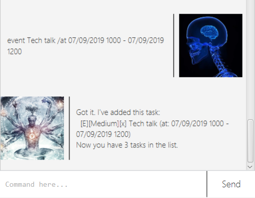
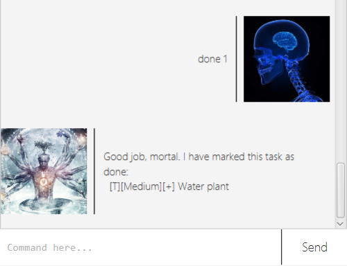
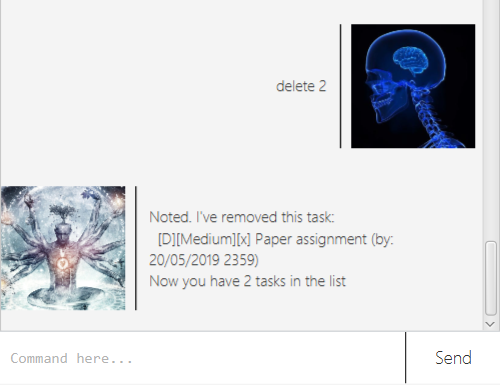

# User Guide

Duke is a conversational bot designed to keep track of users' tasks. Users can "converse"
with Duke with certain keyword commands, followed by parameters if needed.

## Features

### Task type support

In the heart of Duke, there are three types of tasks supported: **Todo** for general tasks,
**Deadline** for tasks that have a certain due date, and **Event** for tasks that have
a range of time.

### Task priority support

Prioritize your tasks with a priority modifier: **Low**, **Medium**, or **High**.

### Local save on hard disk

Every time an operation that prompts changes in data (e.g. `todo`, `done`, `delete`)
is executed, Duke will automatically save it to `data/duke.txt` under Duke's root directory.

Furthermore, when users reopen the app at a later point in time, Duke will read and load the
tasks' data from the file above.

## Usage

### `list` - List tasks

Lists tasks that Duke already stored.

Example usage: 

`list`

Duke will respond:

### `todo` - Creates a Todo task

**Syntax**: `todo NAME`

Creates a Todo task with given name and task priority. The created task will be set
to Medium priority initially, you can change it with the `priority` command.

Example usage:

`todo Water plant`

Duke will respond:

### `deadline` - Creates a Deadline task 

**Syntax**: `deadline NAME /by TIME`
- `TIME` must be in the format `DD/MM/YYYY HHMM` (e.g. `01/01/2000 0159`)

Creates a Deadline task with the given name, priority, and time. The created task will be set
to Medium priority initially, you can change it with the `priority` command.

Example usage: 

`deadline Paper assignment /by 20/05/2019 2359`

Duke will respond:

### `event` - Creates a Event task

**Syntax**: `event NAME /at TIME_START - TIME_END`
- `TIME_START` and `TIME_END` must be in the format `DD/MM/YYYY HHMM` (e.g. `01/01/2000 0159`)

Creates an Event task with the given name, priority, and time range. The created task will be set
to Medium priority initially, you can change it with the `priority` command.

Example usage:

`event Tech talk /at 07/09/2019 1000 - 07/09/2019 1200`

Duke will respond:

### `done` - Marks task as done

**Syntax**: `done TASK_NUMBER`

Marks task with the given task number as done.

Example usage:

`done 1`

Duke will respond:

### `delete` - Deletes a task

**Syntax**: `delete TASK_NUMBER`

Deletes a task with the given task number.

Example usage:

`delete 2`

Duke will respond:

### `find` - Finds tasks

**Syntax**: `find KEYWORD`

Finds tasks that match given keyword, case-insensitive.

Example usage:

`find assignments`

Duke will respond:

### `priority` - Set task priority

**Syntax**: `priority TASK_INDEX PRIORITY`
- `PRIORITY` must be either `high`, `medium`, or `low` (case-insensitive)

Assigns the priority of the given task number to a certain level.

Example usage:

`priority 2 high`

Duke will respond:

